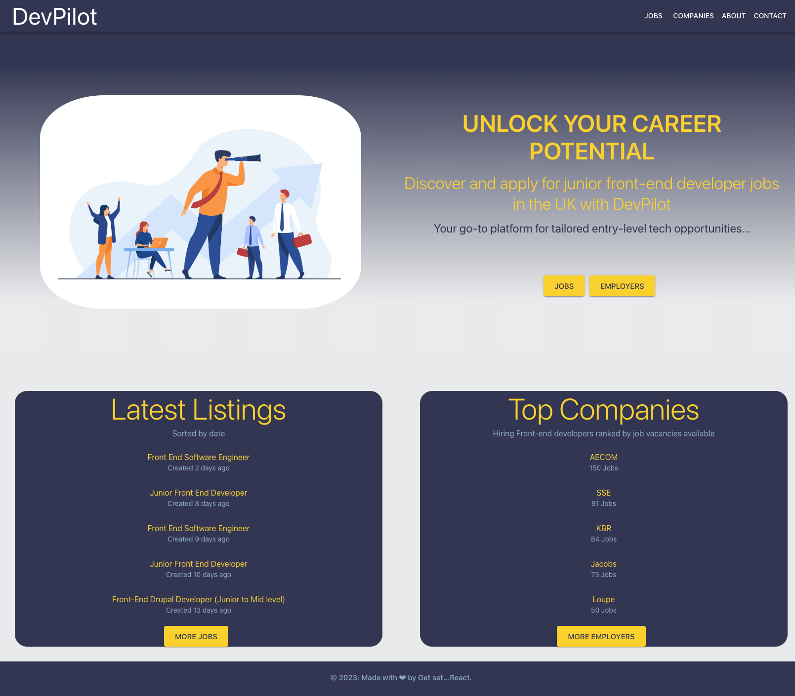

# **DevPilot**

  [](https://opensource.org/license/MIT)


## Table Of Content

- [Description](#description)
- [Deployed website link](#deployedWebsite)
- [Installation](#installation)
- [Usage](#usage)
- [Contributing](#contribution)
- [Tests](#tests)
- [GitHub](#github)

- [License](#license)


  


## **Description**

  DevPilot is a job platform designed specifically for junior front-end developers seeking entry-level opportunities in the UK. It simplifies the job search process by aggregating job listings and company profiles, allowing users to apply directly through the platform. DevPilot utilizes APIs from Adzuna, with React for the front-end and Node.js for NPM.

Motivated by the need to make job searching more accessible and efficient for those new to the tech industry, DevPilot addresses the challenge of finding suitable positions for junior developers or individuals switching careers. By centralizing job postings and providing a user-friendly interface, it serves as a valuable resource for those unsure of where to begin their search.

Through the development of DevPilot, we learned how to effectively integrate multiple job APIs and leverage various technologies, such as React, Node.js, and Material UI, to create a seamless and responsive web application. This project demonstrates the power of combining different tools and resources to solve a real-world problem and support a growing community of tech professionals.

<br>

## **<p>Deployed website: <strong><a href="https://devpilot.netlify.app/">https://devpilot.netlify.app/</a></strong>**


<p align="center">
  <br>
DevPilot landing page
</p>


## **Installation**

To install and run DevPilot on your local machine, follow these steps:

1. **Clone the repository**: First, clone the DevPilot repository from GitHub to your local machine using the following command in your terminal or command prompt:
    
    ```
    
    git clone https://github.com/antonscheving/devpilot.git
    
    ```
    
2. **Navigate to the project directory**: Change your current working directory to the newly created DevPilot folder:
    
    ```
    
    cd devpilot
    
    ```
    
3. **Install dependencies**: Install the necessary dependencies for the project by running the following command:
    
    ```
    
    npm install
    
    ```
    
4. **Start the development server**: Launch the development server by running the following command:
    
    ```
    
    npm start
    
    ```
    
5. **Access the application**: Open your web browser and navigate to **`http://localhost:3000`** to access the DevPilot application.

That's it! You've successfully installed and started the DevPilot application on your local machine.


DevPilot is built with the following tools and libraries: <ul><li>REACT</li> <li>Node.js</li> <li>Adzuna API (http://www.adzuna.co.uk)</li> <li>Material UI</li></ul>


<br>


## **Usage**

To use DevPilot, follow these steps after installing and running the application on your local machine as described in the installation section:

1. **Access the platform**: Open your web browser and navigate to [https://devpilot.netlify.app/](https://devpilot.netlify.app/) to access the DevPilot application.
2. **Browse job listings**: The landing page showcases a curated list of junior front-end developer job listings. Browse through the available positions and click on a job title to view more details about the role.
3. **Search for jobs**: In the jobs page use the search bar to find job listings based on a specific location. 
4. **View company Listings**: In the company page click on the company name to view all job listings from that company. (Currently The Adzuna API, does not provide job listings based on company search)
5. **Apply for jobs**: When you find a job that interests you, click on the listing to be directed to the application page on the original platform. Follow the application instructions provided by the respective platform to submit your application.


## **Contribution**
 
Thank you for considering contributing to this project! Please read the Contributor Covenant before submitting any contributions.

Types of Contributions
We welcome contributions in the form of bug reports, feature requests, code contributions, and documentation improvements.

How to Contribute
Fork the repository and create a new branch.
Make your changes and ensure that they are well-documented and tested.
Submit a pull request to the main repository and include a detailed description of your changes.
Code of Conduct
We expect all contributors to adhere to the Contributor Covenant. Please be respectful and inclusive in your contributions and interactions with others.


## **Tests**
 
To create and run tests for the DevPilot project, you can use Jest and React Testing Library, which are commonly used for testing React applications.

Install dependencies: First, ensure that you have jest and @testing-library/react installed as development dependencies. If not, install them using the following command:
css
Copy code
npm install --save-dev jest @testing-library/react
Create test files: For each component or feature you'd like to test, create a test file in the respective component's folder, following the naming convention: <ComponentName>.test.js.
Write tests: In the test files, import the necessary libraries and the components you want to test. Write test cases using test or it functions provided by Jest, and use React Testing Library utilities like render and screen to interact with your components.


<br>


## **Developers**

<br>

### **Maud Mainnemard**

<p>Front-end developer in the making, currently taking part in a bootcamp in the hope to start a career in Tech. I am not sure where the road will lead so keep in touch to find out.</p>
<a href="https://github.com/maudmain"><strong>GitHub</a></strong>

<a href="https://www.linkedin.com/in/maud-mainnemard/"><strong>Linkedin</a></strong>

<br>

### **Vinita Yadav**

<p>Having certification in Front end web development by edX bootcamp, I am looking for the opportunities to start my career in Tech. Happy to make new connections.</p>
<a href="https://github.com/Vinita686"><strong>GitHub</a></strong>

<a href="https://www.linkedin.com/in/yadav-vinita/"><strong>Linkedin</a></strong>

<br>

### **Anton Scheving**

<p>As a dedicated front-end developer, I am passionate about creating visually appealing and user-friendly websites that effectively communicate a brand's message. With a strong focus on optimizing user experience, I carefully design interfaces that engage visitors and foster seamless interactions, enhancing overall satisfaction and promoting business growth.</p>
<a href="https://github.com/AntonScheving"><strong>GitHub</a></strong>

<a href="https://www.linkedin.com/in/antonscheving/"><strong>Linkedin</a></strong>

<p>Visit my website: <strong><a href="www.antonscheving.com">AntonScheving.com</a></strong></p>

<br>

## License

[](https://opensource.org/license/MIT)


